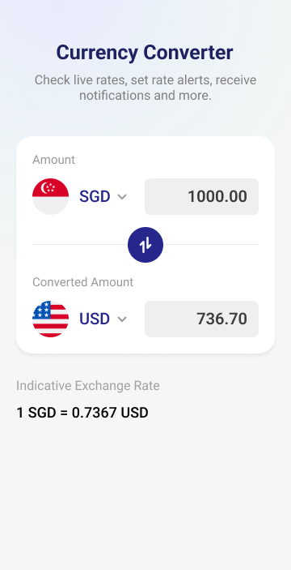

<div align="center">

# 💱 ConvY

### Modern currency converter built with React Native + TypeScript


</div>

---

# 📖 About the Project

ConvY is a cross-platform mobile application developed using React Native and TypeScript for performing real-time currency conversions.

The project was built to explore modern mobile development concepts such as MVVM architecture, Redux state management, REST API consumption, reusable components, responsive interfaces, and scalable project organization.

Users can select currencies, enter values, and instantly receive conversion results through a clean and intuitive interface.

---

# ✨ Features

* 💱 Real-time currency conversion
* 🌎 Multiple currency selection
* ⚡ Fast and modern interface
* 📱 Android and iOS support
* 🔄 Dynamic conversion updates
* 🎨 Responsive UI
* 📦 Global state management with Redux
* 🧩 Reusable component architecture
* 🚨 Custom error handling
* 🏗️ MVVM architecture

---

# 📱 Preview

<div align="center">

</div>

---

# 🛠️ Technologies Used

## Mobile Development

* React Native
* TypeScript
* React 19

## Navigation

* React Navigation
* Native Stack Navigation

## State Management

* Redux Toolkit
* React Redux
* Context API

## Networking

* Axios

## UI & Animations

* Styled Components
* React Native Reanimated
* React Native Gesture Handler
* React Native Linear Gradient
* React Native Vector Icons

## Development Tools

* React Native CLI
* Babel
* Metro
* ESLint
* Jest

---

# 🏗️ Architecture

The project follows the MVVM (Model-View-ViewModel) pattern, promoting better separation of concerns and maintainability.

### Architecture Highlights

* MVVM Pattern
* Redux Global State Management
* Context API
* Component-Based Architecture
* Service Layer Pattern
* Reusable Components

---

# 📂 Project Structure

```bash
Currency_Converter
 ┣ 📂 android
 ┣ 📂 ios
 ┣ 📂 src
 ┃ ┣ 📂 config
 ┃ ┣ 📂 contexts
 ┃ ┣ 📂 models
 ┃ ┣ 📂 navigation
 ┃ ┣ 📂 redux
 ┃ ┣ 📂 screens
 ┃ ┣ 📂 shared
 ┃ ┗ 📂 utils
 ┣ 📄 App.tsx
 ┣ 📄 package.json
 ┣ 📄 tsconfig.json
 ┗ 📄 README.md
```

---

# 💻 Requirements

Before getting started, make sure you have installed:

* Node.js 22+
* React Native CLI
* Android Studio
* Android SDK
* JDK 17+
* Xcode (macOS only)
* CocoaPods (iOS only)
* Android Emulator or physical device

---

# 🚀 Installation

Clone the repository:

```bash
git clone https://github.com/Tuskon/Currency_Converter.git
```

Navigate to the project folder:

```bash
cd Currency_Converter
```

Install dependencies:

```bash
npm install
```

For iOS (macOS only):

```bash
cd ios
pod install
cd ..
```

---

# ☕ Running the Application

Start Metro:

```bash
npm start
```

Open another terminal and run:

### Android

```bash
npm run android
```

### iOS

```bash
npm run ios
```

If everything is configured correctly, the application will launch on your emulator or connected device.

---

# 🔥 Generating APK

Generate a debug APK:

```bash
cd android
gradlew assembleDebug
```

Generate a release APK:

```bash
cd android
gradlew assembleRelease
```

APK output location:

```bash
android/app/build/outputs/apk/
```

---

# 📦 Main Dependencies

```json
{
  "@react-navigation/native": "^7.2.4",
  "@react-navigation/native-stack": "^7.15.1",
  "@reduxjs/toolkit": "^2.12.0",
  "react-redux": "^9.3.0",
  "axios": "^1.16.1",
  "styled-components": "^6.4.1",
  "react-native-reanimated": "^4.3.1",
  "react-native-gesture-handler": "^2.31.2",
  "react-native-linear-gradient": "^2.8.3",
  "react-native-vector-icons": "^10.3.0"
}
```

---

# 🧠 Applied Concepts

* MVVM Architecture
* Redux State Management
* Context API
* REST API Consumption
* API Abstraction Layer
* Component-Based Architecture
* TypeScript Typing
* Responsive UI Design
* Reusable Components
* Navigation Between Screens
* Error Handling
* Mobile Performance Optimization

---

# 👨‍💻 Author

<div align="center">

<a href="https://github.com/Tuskon">
  
</a>

### José Luiz

Software Engineer | Mobile Developer

</div>

---

# ⭐ Support the Project

If this project helped you or inspired you, consider giving it a star ⭐ on GitHub.

---

# 📄 License

This project is licensed under the MIT License.

Feel free to use, modify, and distribute it.

---
